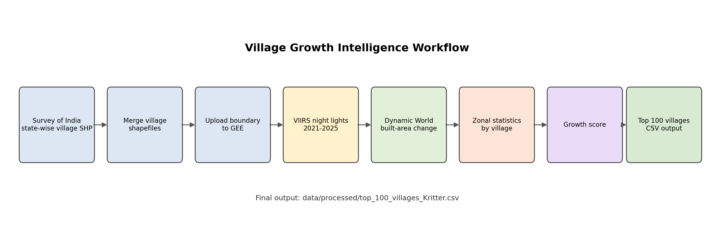

# Village Economic Growth Intelligence

This repository contains a simple workflow for identifying villages in India with strong recent growth signals from satellite data.

## What is included

- `gee/village_growth_feature_extraction.js` - Google Earth Engine script for VIIRS night-light growth and Dynamic World built-area growth.
- `src/clean_gee_top100_export.py` - cleanup helper for Google Earth Engine CSV exports.
- `data/processed/top_100_villages_Kritter.csv` - submitted ranked output cleaned from the Google Earth Engine export.
- `data/processed/top_100_villages.csv` - duplicate convenience copy of the submitted ranked output.
- `docs/figures/workflow.png` - methodology flow chart.
- `docs/methodology.md` - simple methodology note.
- `docs/slides_outline.md` - 5-7 slide presentation structure.

## Used datasets

- Survey of India village boundary database: https://surveyofindia.gov.in/pages/village-boundary-data-base-of-entire-india
- VIIRS monthly night-time lights: `NOAA/VIIRS/DNB/MONTHLY_V1/VCMSLCFG`
- Google Dynamic World built-area probability: `GOOGLE/DYNAMICWORLD/V1`

The submitted result was produced in Google Earth Engine from the uploaded village polygon asset, cleaned with `src/clean_gee_top100_export.py`, and saved at `data/processed/top_100_villages_Kritter.csv`.

## Scoring

Villages were ranked using night-light growth from 2021 to 2025. The GEE script also includes Dynamic World built-area growth as an added signal.

## Google Earth Engine extraction

Open `gee/village_growth_feature_extraction.js` in the Earth Engine Code Editor, confirm the village asset path, run the export task, and save the exported CSV under `data/processed/`.

Final files to review: `data/processed/top_100_villages_Kritter.csv`, `gee/village_growth_feature_extraction.js`, and `docs/methodology.md`.
